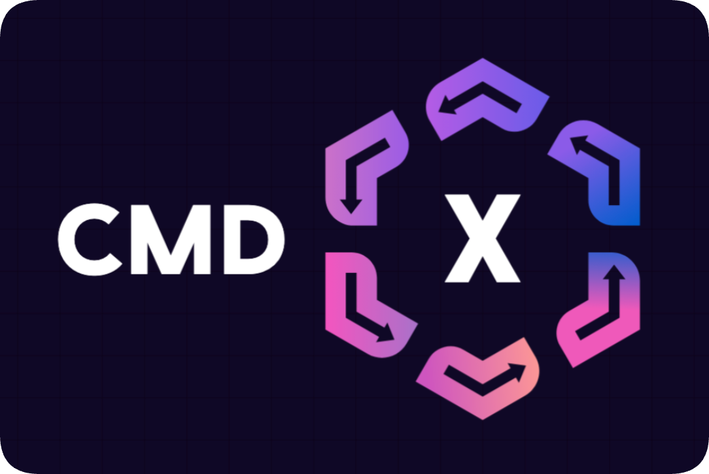

<p align="center">
  
</p>

<p align="center">
  
  
  
</p>

# 🚀 CMDx — Business logic without the chaos

Stop wrestling with messy service objects. CMDx gives you a clean, consistent way to design business processes:

- Start small with a single `work` method
- Scale to complex tasks and multi-step workflows
- Get built-in flow control, logging, validations, and more...

*Build faster. Debug easier. Stay sane.*

## Installation

Add this line to your application's Gemfile:

```ruby
gem 'cmdx'
```

And then execute:

    $ bundle

Or install it yourself as:

    $ gem install cmdx

## Quick Example

Here's how a quick 3 step process can open up a world of possibilities:

```ruby
# 1. Setup tasks
# ---------------------------------

# Bare minimum
class SendAnalyzedEmail < CMDx::Task
  def work
    user = User.find(context.user_id)
    MetricsMailer.analyzed(user).deliver_now
  end
end

# Kitchen sink
class AnalyzeMetrics < CMDx::Task
  register :middleware, CMDx::Middlewares::Correlate, id: -> { Current.request_id }

  on_success :track_analysis_completion!

  required :dataset_id, type: :integer, numeric: { min: 1 }
  optional :analysis_type, default: "standard"

  def work
    if dataset.nil?
      fail!("Dataset not found", code: 404)
    elsif dataset.unprocessed?
      skip!("Dataset not ready for analysis")
    else
      context.result = PValueAnalyzer.execute(dataset:, analysis_type:)
      context.analyzed_at = Time.now

      SendAnalyzedEmail.execute(user_id: Current.account.manager_id)
    end
  end

  private

  def dataset
    @dataset ||= Dataset.find_by(id: dataset_id)
  end

  def track_analysis_completion!
    dataset.update!(analysis_result_id: context.result.id)
  end
end

# 2. Execute task
# ---------------------------------
result = AnalyzeMetrics.execute(
  dataset_id: 123,
  "analysis_type" => "advanced"
)

# 3. Handle result
# ---------------------------------
if result.success?
  puts "Metrics analyzed at #{result.context.analyzed_at}"
elsif result.skipped?
  puts "Skipping analyzation due to: #{result.reason}"
elsif result.failed?
  puts "Analyzation failed due to: #{result.reason} with code #{result.metadata[:code]}"
end
```

## Table of contents

- [Getting Started](docs/getting_started.md)
- Basics
  - [Setup](docs/basics/setup.md)
  - [Execution](docs/basics/execution.md)
  - [Context](docs/basics/context.md)
  - [Chain](docs/basics/chain.md)
- Interruptions
  - [Halt](docs/interruptions/halt.md)
  - [Faults](docs/interruptions/faults.md)
  - [Exceptions](docs/interruptions/exceptions.md)
- Outcomes
  - [Result](docs/outcomes/result.md)
  - [States](docs/outcomes/states.md)
  - [Statuses](docs/outcomes/statuses.md)
- Attributes
  - [Definitions](docs/attributes/definitions.md)
  - [Naming](docs/attributes/naming.md)
  - [Coercions](docs/attributes/coercions.md)
  - [Validations](docs/attributes/validations.md)
  - [Defaults](docs/attributes/defaults.md)
- [Callbacks](docs/callbacks.md)
- [Middlewares](docs/middlewares.md)
- [Logging](docs/logging.md)
- [Internationalization (i18n)](docs/internationalization.md)
- [Deprecation](docs/deprecation.md)
- [Workflows](docs/workflows.md)
- [Tips and Tricks](docs/tips_and_tricks.md)

## Ecosystem

- [cmdx-rspec](https://github.com/drexed/cmdx-rspec) - RSpec test matchers

For backwards compatibility for versions before `1.7.0`

- [cmdx-i18n](https://github.com/drexed/cmdx-i18n) - 85+ translations
- [cmdx-parallel](https://github.com/drexed/cmdx-parallel) - Parallel workflow tasks

## Development

After checking out the repo, run `bin/setup` to install dependencies. Then, run `rake spec` to run the tests. You can also run `bin/console` for an interactive prompt that will allow you to experiment.

To install this gem onto your local machine, run `bundle exec rake install`. To release a new version, update the version number in `version.rb`, and then run `bundle exec rake release`, which will create a git tag for the version, push git commits and tags, and push the `.gem` file to [rubygems.org](https://rubygems.org).

## Contributing

Bug reports and pull requests are welcome on GitHub at https://github.com/drexed/cmdx. This project is intended to be a safe, welcoming space for collaboration, and contributors are expected to adhere to the [Contributor Covenant](http://contributor-covenant.org) code of conduct.

## License

The gem is available as open source under the terms of the [MIT License](https://opensource.org/licenses/MIT).

## Code of Conduct

Everyone interacting in the CMDx project's codebases, issue trackers, chat rooms and mailing lists is expected to follow the [code of conduct](CODE_OF_CONDUCT.md).
