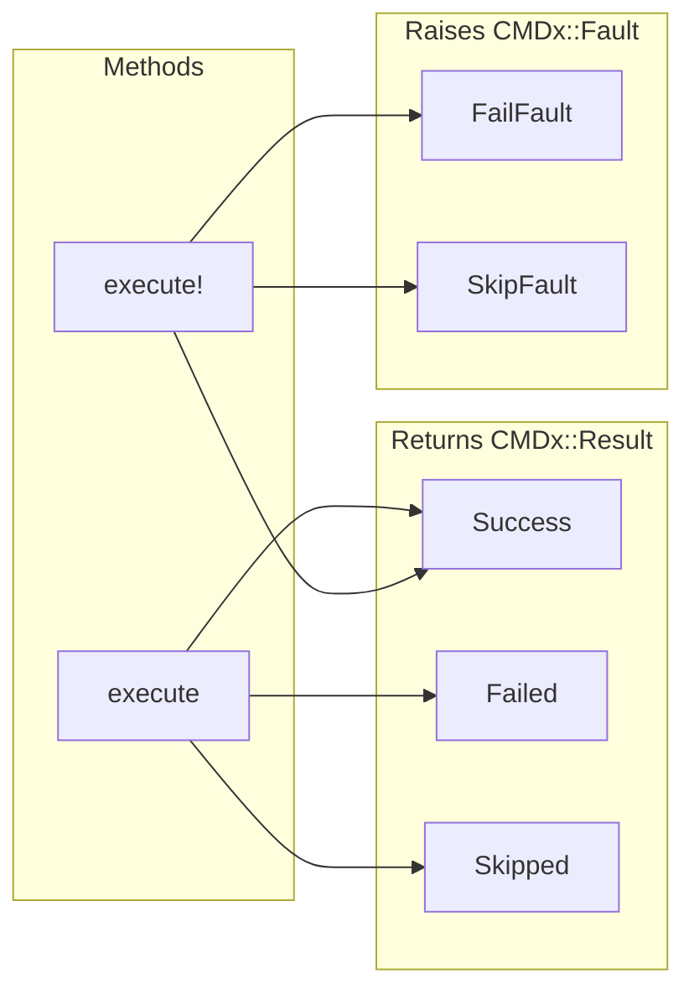

# Basics - Execution

CMDx offers two execution methods with different error handling approaches. Choose based on your needs: safe result handling or exception-based control flow.

## Execution Methods

Both methods return results, but handle failures differently:

| Method | Returns | Exceptions | Use Case |
|--------|---------|------------|----------|
| `execute` | Always returns `CMDx::Result` | Never raises | Predictable result handling |
| `execute!` | Returns `CMDx::Result` on success | Raises `CMDx::Fault` when skipped or failed | Exception-based control flow |



## Non-bang Execution

Always returns a `CMDx::Result`, never raises exceptions. Perfect for most use cases.

```ruby
result = CreateAccount.execute(email: "user@example.com")

# Check execution state
result.success?         #=> true/false
result.failed?          #=> true/false
result.skipped?         #=> true/false

# Access result data
result.context.email    #=> "user@example.com"
result.state            #=> "complete"
result.status           #=> "success"
```

## Bang Execution

Raises `CMDx::Fault` exceptions on failure or skip. Returns results only on success.

| Exception | Raised When |
|-----------|-------------|
| `CMDx::FailFault` | Task execution fails |
| `CMDx::SkipFault` | Task execution is skipped |

!!! warning "Important"

    Behavior depends on `task_breakpoints` or `workflow_breakpoints` config. Default: only failures raise exceptions.

```ruby
begin
  result = CreateAccount.execute!(email: "user@example.com")
  SendWelcomeEmail.execute(result.context)
rescue CMDx::FailFault => e
  ScheduleAccountRetryJob.perform_later(e.result.context.email)
rescue CMDx::SkipFault => e
  Rails.logger.info("Account creation skipped: #{e.result.reason}")
rescue Exception => e
  ErrorTracker.capture(unhandled_exception: e)
end
```

## Direct Instantiation

Tasks can be instantiated directly for advanced use cases, testing, and custom execution patterns:

```ruby
# Direct instantiation
task = CreateAccount.new(email: "user@example.com", send_welcome: true)

# Access properties before execution
task.id                      #=> "abc123..." (unique task ID)
task.context.email           #=> "user@example.com"
task.context.send_welcome    #=> true
task.result.state            #=> "initialized"
task.result.status           #=> "success"

# Manual execution
task.execute
# or
task.execute!

task.result.success?         #=> true/false
```

## Result Details

The `Result` object provides comprehensive execution information:

```ruby
result = CreateAccount.execute(email: "user@example.com")

# Execution metadata
result.id           #=> "abc123..."  (unique execution ID)
result.task         #=> CreateAccount instance (frozen)
result.chain        #=> Task execution chain

# Context and metadata
result.context      #=> Context with all task data
result.metadata     #=> Hash with execution metadata
```

## Dry Run

Execute tasks in dry-run mode to simulate execution without performing side effects. Pass `dry_run: true` in the context when initializing or executing the task.

Inside your task, use the `dry_run?` method to conditionally skip side effects.

```ruby
class CloseStripeCard < CMDx::Task
  def work
    context.stripe_result =
      if dry_run?
        FactoryBot.build(:stripe_closed_card)
      else
        StripeApi.close_card(context.card_id)
      end
  end
end

# Execute in dry-run mode
result = CloseStripeCard.execute(card_id: "card_abc123", dry_run: true)
result.success? # => true

# FactoryBot object
result.context.stripe_result = {
  card_id: "card_abc123",
  status: "closed"
}
```
