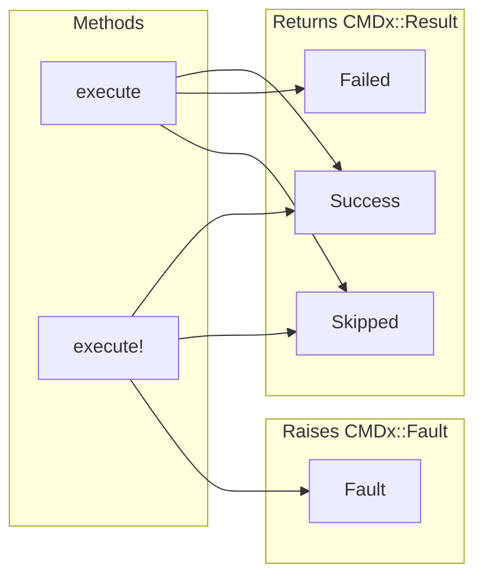

# Basics - Execution

CMDx offers two execution methods with different error handling approaches. Choose based on your needs: safe result handling or exception-based control flow.

## Execution Methods

Both methods return results, but handle failures differently:

| Method | Returns | Exceptions | Use Case |
|--------|---------|------------|----------|
| `execute` | Always returns `CMDx::Result` | Never raises | Branch on `result.success?` / `failed?` / `skipped?` |
| `execute!` | Returns `CMDx::Result` on success or skip | Raises `CMDx::Fault` (or the underlying exception) when failed | Exception-based control flow |

`call` / `call!` are aliases. `execute` / `execute!` also accept a block — when given, the block receives the `Result` and its return value is returned instead of the result.


```mermaid
flowchart LR
    subgraph Methods
        E[execute]
        EB[execute!]
    end

    subgraph Returns [Returns CMDx::Result]
        Success
        Failed
        Skipped
    end

    subgraph Raises [Raises CMDx::Fault]
        Fault
    end

    E --> Success
    E --> Failed
    E --> Skipped

    EB --> Success
    EB --> Skipped
    EB --> Fault
```

`Skipped` is **not** a failure — `execute!` returns the skipped `Result` rather than raising. Only `failed?` results raise.

## Non-bang Execution

Always returns a `CMDx::Result`, never raises. Default choice for most call sites.

```ruby
result = CreateAccount.execute(email: "user@example.com")
result.context.email #=> "user@example.com"

# Block form — returns whatever the block returns
CreateAccount.execute(email: "user@example.com") do |result|
  result.success? ? result.context.account_id : nil
end
```

## Bang Execution

Raises `CMDx::Fault` on failure (or the originating `StandardError` if one was captured as the cause). Returns the result on success or skip.

```ruby
begin
  result = CreateAccount.execute!(email: "user@example.com")
  SendWelcomeEmail.execute(result.context)
rescue CMDx::Fault => e
  Rails.logger.warn("#{e.task} failed: #{e.message}")
  ScheduleAccountRetryJob.perform_later(email: "user@example.com")
rescue StandardError => e
  ErrorTracker.capture(unhandled_exception: e)
end
```
