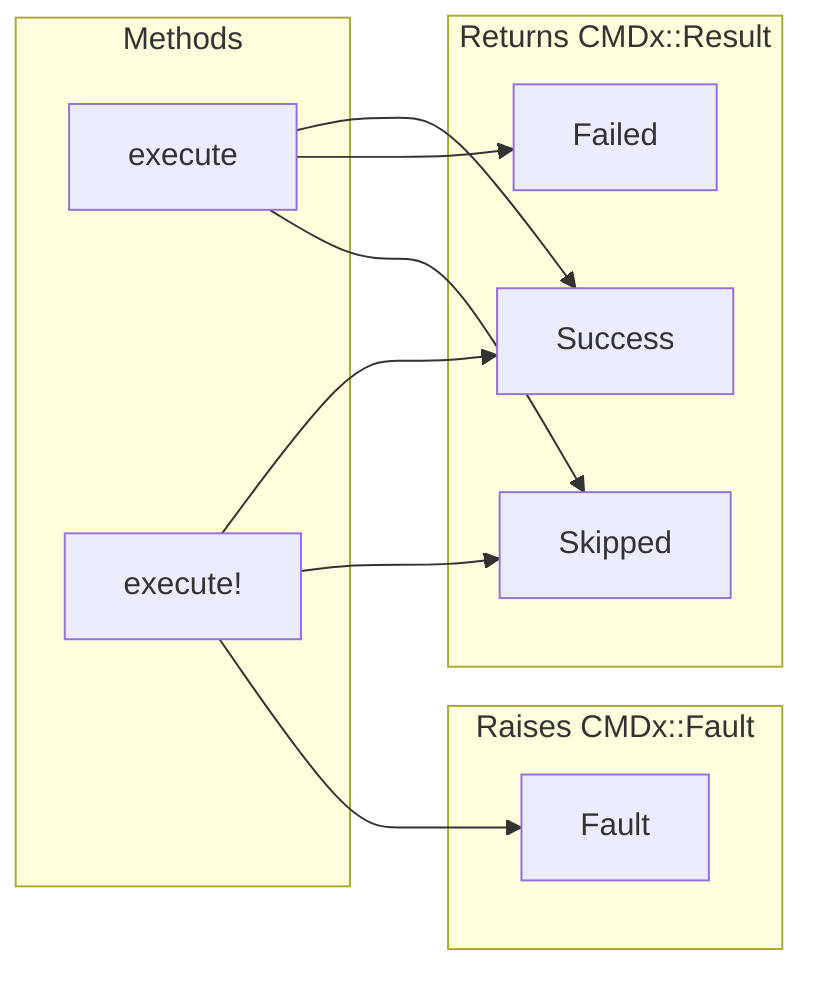

# Basics - Execution

CMDx gives you two front doors: one that **always** hands you a result object, and one that **raises** when something actually failed. Pick the style that fits the calling code — no shame either way.

## Execution Methods

Same task, two vibes:

| Method | What you get | Exceptions | When to use it |
|--------|--------------|------------|----------------|
| `execute` | A `CMDx::Result` every time — success, skip, or fail | Ordinary failures don’t raise; you inspect the result. **Framework** mistakes (`CMDx::Error` subclasses: `ImplementationError`, `MiddlewareError`, `CallbackError`, `DefinitionError`, `DeprecationError`) still bubble up — those are “fix your app” problems, not user errors. | `if result.success?` … else … |
| `execute!` | A `Result` on success or skip | Raises `CMDx::Fault` when the task **failed**, or re-raises the original `StandardError` from `work` when that’s what happened | `rescue` blocks, “let it blow” controllers, jobs that retry on exception |

`call` / `call!` are aliases — same behavior. You can also pass a block to `execute` / `execute!`: the block gets the `Result`, and **whatever the block returns** becomes the return value of the call (instead of the raw `Result`).

Already holding a task instance? `Task#execute(strict:)` is public too:

```ruby
task   = CreateAccount.new(email: "user@example.com")
result = task.execute              # strict: false → returns Result
task.execute(strict: true)         # strict: true  → raises Fault on failure
```


```mermaid
flowchart LR
    subgraph Methods
        E[execute]
        EB[execute!]
    end

    subgraph Returns [Returns CMDx::Result]
        Success
        Failed
        Skipped
    end

    subgraph Raises [Raises CMDx::Fault]
        Fault
    end

    E --> Success
    E --> Failed
    E --> Skipped

    EB --> Success
    EB --> Skipped
    EB --> Fault
```

**Skip is not fail.** `execute!` is happy to return a skipped `Result`; it only raises when `failed?` is true.

## Non-bang Execution

The default for most app code: you always get a `Result`. Check `.success?`, `.failed?`, or `.skipped?` and branch. Framework errors still raise — that’s intentional so misconfigurations don’t vanish into a “failed” result.

```ruby
result = CreateAccount.execute(email: "user@example.com")
result.context.email #=> "user@example.com"

# Block form — returns whatever the block returns
CreateAccount.execute(email: "user@example.com") do |result|
  result.success? ? result.context.account_id : nil
end
```

## Bang Execution

`execute!` says: “If this failed, wake me up with an exception.” On success or skip you still get the `Result`. On failure you get `CMDx::Fault` (or the original error in strict scenarios — see the note below).

```ruby
begin
  result = CreateAccount.execute!(email: "user@example.com")
  SendWelcomeEmail.execute(result.context)
rescue CMDx::Fault => e
  Rails.logger.warn("#{e.task} failed: #{e.message}")
  ScheduleAccountRetryJob.perform_later(email: "user@example.com")
rescue StandardError => e
  ErrorTracker.capture(unhandled_exception: e)
end
```

!!! note "Strict re-raise order"

    If `work` raises a normal app `StandardError`, the runtime stores it on `result.cause` **and**, in strict mode, re-raises the **original** exception — not always wrapped as `Fault`. Put `rescue CMDx::Fault` **before** `rescue StandardError` because `Fault` inherits from `StandardError`. Halts from `fail!` / `throw!` / validation / output checks don’t set that cause the same way; you’ll see `Fault` with failure details on `fault.result`.

!!! note "Teardown ordering"

    The `Result` is finalized **before** a strict re-raise, and teardown (freeze + chain cleanup) runs in `ensure`. So inside `rescue`, `fault.result`, `fault.context`, and `fault.chain` are safe to read — and you still get lifecycle logging / `:task_executed` telemetry even when strict mode raises.
