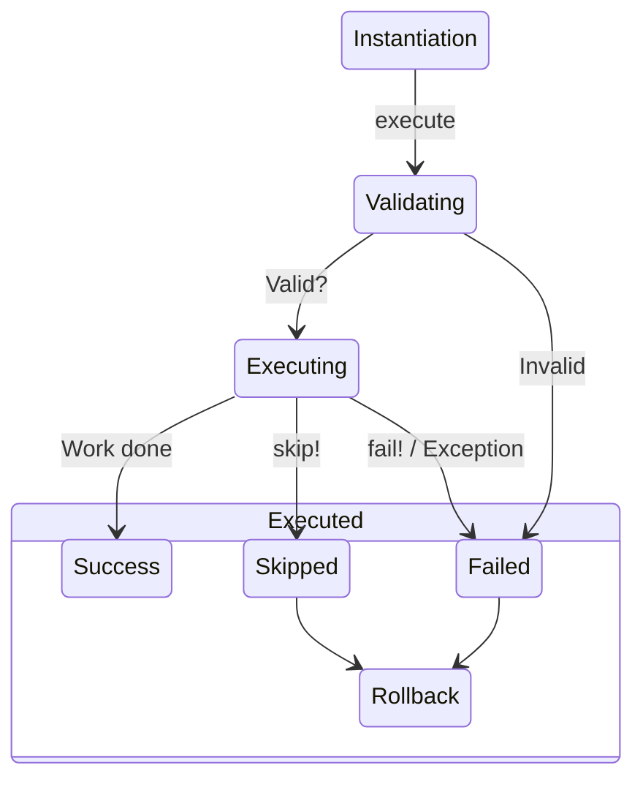

# Basics - Setup

Tasks are the heart of CMDx—self-contained units of business logic with built-in validation, error handling, and execution tracking.

## Structure

Tasks need only two things: inherit from `CMDx::Task` and define a `work` method:

```ruby
class ValidateDocument < CMDx::Task
  def work
    # Your logic here...
  end
end
```

Without a `work` method, execution raises `CMDx::UndefinedMethodError`.

```ruby
class IncompleteTask < CMDx::Task
  # No `work` method defined
end

IncompleteTask.execute #=> raises CMDx::UndefinedMethodError
```

## Rollback

Undo any operations linked to the given status, helping to restore a pristine state.

```ruby
class ChargeCard < CMDx::Task
  def work
    # Your logic here, ex: charge $100
  end

  # Called automatically if a later step in the workflow fails
  def rollback
    # Your undo logic, ex: void $100 charge
  end
end
```

## Inheritance

Share configuration across tasks using inheritance:

```ruby
class ApplicationTask < CMDx::Task
  register :middleware, SecurityMiddleware

  before_execution :initialize_request_tracking

  attribute :session_id

  private

  def initialize_request_tracking
    context.tracking_id ||= SecureRandom.uuid
  end
end

class SyncInventory < ApplicationTask
  def work
    # Your logic here...
  end
end
```

## Lifecycle

Tasks follow a predictable execution pattern:



!!! danger "Caution"

    Tasks are single-use objects. Once executed, they're frozen and immutable.

| Stage | State | Status | Description |
|-------|-------|--------|-------------|
| **Instantiation** | `initialized` | `success` | Task created with context |
| **Validation** | `executing` | `success`/`failed` | Attributes validated |
| **Execution** | `executing` | `success`/`failed`/`skipped` | `work` method runs |
| **Completion** | `executed` | `success`/`failed`/`skipped` | Result finalized |
| **Freezing** | `executed` | `success`/`failed`/`skipped` | Task becomes immutable |
| **Rollback** | `executed` | `failed`/`skipped` | Work undone |
