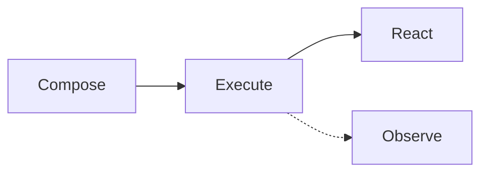

# Getting Started

CMDx is a Ruby framework for building maintainable, observable business logic through composable command objects. It brings structure, consistency, and powerful developer tools to your business processes.

**Common challenges:**

- Inconsistent service object patterns across your codebase
- Black boxes make debugging a nightmare
- Fragile error handling erodes confidence

**What you get:**

- Consistent, standardized architecture
- Built-in flow control and error handling
- Composable, reusable workflows
- Comprehensive logging for observability
- Attribute validation with type coercions
- Sensible defaults and developer-friendly APIs

## Installation

Add CMDx to your Gemfile:

```sh
gem install cmdx

# - or -

bundle add cmdx
```

## Configuration

For Rails applications, run the following command to generate a global configuration file in `config/initializers/cmdx.rb`.

```bash
rails generate cmdx:install
```

If not using Rails, manually copy the [configuration file](https://github.com/drexed/cmdx/blob/main/lib/generators/cmdx/templates/install.rb).

## The CERO Pattern

CMDx embraces the Compose, Execute, React, Observe (CERO, pronounced "zero") pattern—a simple yet powerful approach to building reliable business logic.



### Compose

Build reusable, single-responsibility tasks with typed attributes, validation, and callbacks. Tasks can be chained together in workflows to create complex business processes from simple building blocks.

```ruby
class AnalyzeMetrics < CMDx::Task
  def work
    # Your logic here...
  end
end
```

### Execute

Invoke tasks with a consistent API that always returns a result object. Execution automatically handles validation, type coercion, error handling, and logging. Arguments are validated and coerced before your task logic runs.

```ruby
# Without args
result = AnalyzeMetrics.execute

# With args
result = AnalyzeMetrics.execute(model: "blackbox", "sensitivity" => 3)
```

### React

Every execution returns a result object with a clear outcome. Check the result's state (`success?`, `failed?`, `skipped?`) and access returned values, error messages, and metadata to make informed decisions.

```ruby
if result.success?
  # Handle success
elsif result.skipped?
  # Handle skipped
elsif result.failed?
  # Handle failed
end
```

### Observe

Every task execution generates structured logs with execution chains, runtime metrics, and contextual metadata. Logs can be automatically correlated using chain IDs, making it easy to trace complex workflows and debug issues.

```log
I, [2022-07-17T18:42:37.000000 #3784] INFO -- CMDx:
index=1 chain_id="018c2b95-23j4-2kj3-32kj-3n4jk3n4jknf" type="Task" class="SendAnalyzedEmail" state="complete" status="success" metadata={runtime: 347}

I, [2022-07-17T18:43:15.000000 #3784] INFO -- CMDx:
index=0 chain_id="018c2b95-b764-7615-a924-cc5b910ed1e5" type="Task" class="AnalyzeMetrics" state="complete" status="success" metadata={runtime: 187}
```

!!! note

    This represents a log-only event-sourcing approach, enabling full traceability and a complete, time-ordered view of system behavior.

## Domain Driven Design

CMDx facilitates Domain Driven Design (DDD) by making business processes explicit and structural.

### Ubiquitous Language

Task names like `ApproveLoan` or `ShipOrder` mirror the language of domain experts, creating a shared vocabulary that eliminates translation gaps between business requirements and code.

### Bounded Contexts

Namespaces naturally enforce boundaries. `Billing::GenerateInvoice` and `Shipping::GenerateLabel` encapsulate logic within their specific domains, preventing leakage and "God objects."

### Rich Domain Layer

Move orchestration and rules out of Controllers and ActiveRecord models. Entities focus on state; CMDx tasks handle behavior. This separation prevents "Fat Models" and keeps business logic testable and isolated.

## Event Sourcing Replacement

Traditional Event Sourcing architectures impose a significant "complexity tax"—requiring specialized event stores, snapshots, and complex state rehydration logic. CMDx offers a pragmatic alternative: **Log-Based Event Sourcing**.

By ensuring all state changes occur through CMDx tasks, your structured logs become a complete, immutable ledger of system behavior.

### Audit Trail

Every execution is automatically logged with its inputs, status, and metadata. This provides a detailed history of *intent* (arguments) and *outcome* (success/failure) without extra coding.

### Reconstructability

Because commands encapsulate all inputs required for an action, you can reconstruct past system states or replay business logic by inspecting the command history, giving you the traceability of Event Sourcing without the infrastructure overhead.

### Simplified Architecture

Keep your standard relational database for current state queries (the "Read Model") while using CMDx logs as your historical record (the "Write Model"). This gives you CQRS-like benefits without the complexity of maintaining separate projections.

## Task Generator

Generate new CMDx tasks quickly using the built-in generator:

```bash
rails generate cmdx:task ModerateBlogPost
```

This creates a new task file with the basic structure:

```ruby
# app/tasks/moderate_blog_post.rb
class ModerateBlogPost < CMDx::Task
  def work
    # Your logic here...
  end
end
```

!!! tip

    Use **present tense verbs + noun** for task names, eg: `ModerateBlogPost`, `ScheduleAppointment`, `ValidateDocument`

## Type safety

CMDx includes built-in RBS (Ruby Type Signature) inline annotations throughout the codebase, providing type information for static analysis and editor support.

- **Type checking** — Catch type errors before runtime using tools like Steep or TypeProf
- **Better IDE support** — Enhanced autocomplete, navigation, and inline documentation
- **Self-documenting code** — Clear method signatures and return types
- **Refactoring confidence** — Type-aware refactoring reduces bugs
