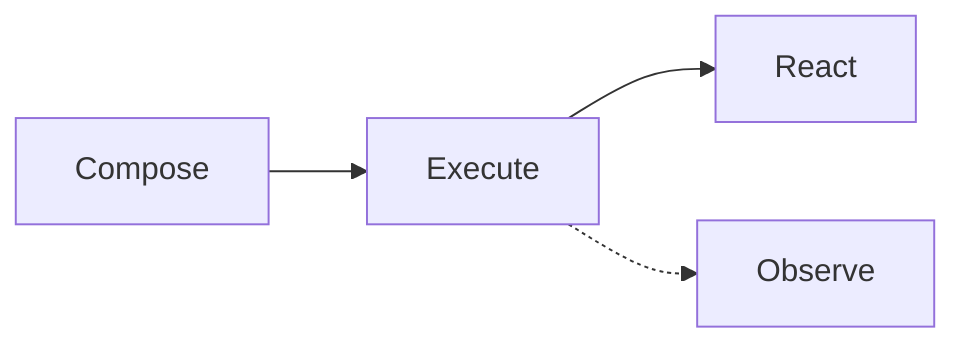

# Getting Started

[](https://rubygems.org/gems/cmdx)
[](https://github.com/drexed/cmdx/actions/workflows/ci.yml)
[](https://github.com/drexed/cmdx/blob/main/LICENSE.txt)

---

!!! note

    Documentation reflects the latest code on `main`. For version-specific documentation, please refer to the `docs/` directory within that version's tag.

CMDx is a Ruby framework for building maintainable, observable business logic through composable command objects. It brings structure, consistency, and powerful developer tools to your business processes.

**Common challenges:**

- Inconsistent service object patterns across your codebase
- Black boxes make debugging a nightmare
- Fragile error handling erodes confidence

**What you get:**

- Consistent, standardized architecture
- Built-in flow control and error handling
- Composable, reusable workflows
- Comprehensive logging for observability
- Attribute validation with type coercions

## Requirements

- Ruby: MRI 3.1+ or JRuby 9.4+
- Dependencies: None

Rails support is built-in, but it's framework-agnostic at its core.

## Installation

Add CMDx to your Gemfile:

```sh
gem install cmdx

# - or -

bundle add cmdx
```

## Configuration

For Rails applications, run the following command to generate a global configuration file in `config/initializers/cmdx.rb`.

```bash
rails generate cmdx:install
```

If not using Rails, manually copy the [configuration file](https://github.com/drexed/cmdx/blob/main/lib/generators/cmdx/templates/install.rb).

## The CERO Pattern

CMDx embraces the Compose, Execute, React, Observe (CERO, pronounced "zero") pattern—a simple yet powerful approach to building reliable business logic.



### Compose

Build reusable, single-responsibility tasks with typed attributes, validation, and callbacks. Tasks can be chained together in workflows to create complex business processes from simple building blocks.

=== "Full Featured Task"

    ```ruby
    class AnalyzeMetrics < CMDx::Task
      register :middleware, CMDx::Middlewares::Correlate, id: -> { Current.request_id }

      on_success :track_analysis_completion!

      required :dataset_id, type: :integer, numeric: { min: 1 }
      optional :analysis_type, default: "standard"

      def work
        if dataset.nil?
          fail!("Dataset not found", code: 404)
        elsif dataset.unprocessed?
          skip!("Dataset not ready for analysis")
        else
          context.result = PValueAnalyzer.execute(dataset:, analysis_type:)
          context.analyzed_at = Time.now

          SendAnalyzedEmail.execute(user_id: Current.account.manager_id)
        end
      end

      private

      def dataset
        @dataset ||= Dataset.find_by(id: dataset_id)
      end

      def track_analysis_completion!
        dataset.update!(analysis_result_id: context.result.id)
      end
    end
    ```

=== "Minimum Viable Task"

    ```ruby
    class SendAnalyzedEmail < CMDx::Task
      def work
        user = User.find(context.user_id)
        MetricsMailer.analyzed(user).deliver_now
      end
    end
    ```

### Execute

Invoke tasks with a consistent API that always returns a result object. Execution automatically handles validation, type coercion, error handling, and logging. Arguments are validated and coerced before your task logic runs.

=== "With args"

    ```ruby
    result = AnalyzeMetrics.execute(model: "blackbox", "sensitivity" => 3)
    ```

=== "Without args"

    ```ruby
    result = AnalyzeMetrics.execute
    ```

### React

Every execution returns a result object with a clear outcome. Check the result's state (`success?`, `failed?`, `skipped?`) and access returned values, error messages, and metadata to make informed decisions.

```ruby
if result.success?
  puts "Metrics analyzed at #{result.context.analyzed_at}"
elsif result.skipped?
  puts "Skipping analyzation due to: #{result.reason}"
elsif result.failed?
  puts "Analyzation failed due to: #{result.reason} with code #{result.metadata[:code]}"
end
```

### Observe

Every task execution generates structured logs with execution chains, runtime metrics, and contextual metadata. Logs can be automatically correlated using chain IDs, making it easy to trace complex workflows and debug issues.

```log
I, [2022-07-17T18:42:37.000000 #3784] INFO -- CMDx:
index=1 chain_id="018c2b95-23j4-2kj3-32kj-3n4jk3n4jknf" type="Task" class="SendAnalyzedEmail" state="complete" status="success" metadata={runtime: 347}

I, [2022-07-17T18:43:15.000000 #3784] INFO -- CMDx:
index=0 chain_id="018c2b95-b764-7615-a924-cc5b910ed1e5" type="Task" class="AnalyzeMetrics" state="complete" status="success" metadata={runtime: 187}
```

!!! note

    This represents a log-only event-sourcing approach, enabling full traceability and a complete, time-ordered view of system behavior.

## Domain Driven Design

CMDx facilitates Domain Driven Design (DDD) by making business processes explicit and structural.

- **Ubiquitous Language:** Task names like `ApproveLoan` or `ShipOrder` mirror the language of domain experts, creating a shared vocabulary that eliminates translation gaps between business requirements and code.

- **Bounded Contexts:** Namespaces naturally enforce boundaries. `Billing::GenerateInvoice` and `Shipping::GenerateLabel` encapsulate logic within their specific domains, preventing leakage and "God objects."

- **Rich Domain Layer:** Move orchestration and rules out of Controllers and ActiveRecord models. Entities focus on state; CMDx tasks handle behavior. This separation prevents "Fat Models" and keeps business logic testable and isolated.

## Event Sourcing Replacement

Traditional Event Sourcing architectures impose a significant "complexity tax"—requiring specialized event stores, snapshots, and complex state rehydration logic. CMDx offers a pragmatic alternative: **Log-Based Event Sourcing**.

By ensuring all state changes occur through CMDx tasks, your structured logs become a complete, immutable ledger of system behavior.

- **Audit Trail:** Every execution is automatically logged with its inputs, status, and metadata. This provides a detailed history of *intent* (arguments) and *outcome* (success/failure) without extra coding.

- **Reconstructability** Because commands encapsulate all inputs required for an action, you can reconstruct past system states or replay business logic by inspecting the command history, giving you the traceability of Event Sourcing without the infrastructure overhead.

- **Simplified Architecture** Keep your standard relational database for current state queries (the "Read Model") while using CMDx logs as your historical record (the "Write Model"). This gives you CQRS-like benefits without the complexity of maintaining separate projections.

## Task Generator

Generate new CMDx tasks quickly using the built-in generator:

```bash
rails generate cmdx:task ModerateBlogPost
```

This creates a new task file with the basic structure:

```ruby
# app/tasks/moderate_blog_post.rb
class ModerateBlogPost < CMDx::Task
  def work
    # Your logic here...
  end
end
```

!!! tip

    Use **present tense verbs + noun** for task names, eg: `ModerateBlogPost`, `ScheduleAppointment`, `ValidateDocument`

## Type safety

CMDx includes built-in RBS (Ruby Type Signature) inline annotations throughout the codebase, providing type information for static analysis and editor support.

- **Type checking** — Catch type errors before runtime using tools like Steep or TypeProf
- **Better IDE support** — Enhanced autocomplete, navigation, and inline documentation
- **Self-documenting code** — Clear method signatures and return types
- **Refactoring confidence** — Type-aware refactoring reduces bugs
