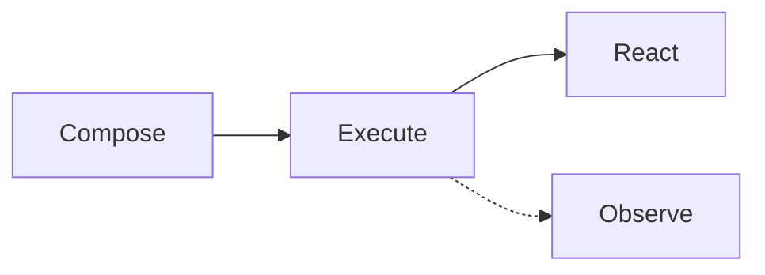
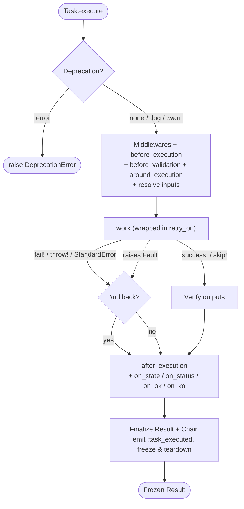

# Getting Started

[](https://rubygems.org/gems/cmdx)
[](https://github.com/drexed/cmdx/actions/workflows/ci.yml)
[](https://github.com/drexed/cmdx/blob/main/LICENSE.txt)

---

!!! note

    These docs follow `main`. If you are on an older gem version, open the `docs/` folder from that release’s tag so examples match what you run.

Welcome. **CMDx** is a small Ruby framework that helps you write business logic as clear, reusable **tasks**—think “one job per class,” with inputs checked for you, errors handled in a predictable way, and logs that tell a story when things go wrong.

If you have ever opened a “service object” file and wondered *what actually runs, in what order, and what happens on error*, CMDx is meant to calm that chaos.

**Sound familiar?**

- Every team invents its own “service” pattern, so nothing feels the same from file to file.
- When something breaks, it is hard to follow the path the code took.
- Error handling is inconsistent, so you stop trusting the happy path.

**What CMDx gives you instead:**

- One clear contract: how you declare inputs, run work, and read the outcome.
- Built-in flow control (success, skip, fail) so branches are explicit, not hidden.
- Workflows that chain tasks without spaghetti.
- Structured logging so you can see what ran, how long it took, and why it stopped.
- Input validation and type coercion so bad data fails fast with useful messages.

## Requirements

- **Ruby:** MRI 3.3+ (or a recent JRuby / TruffleRuby that matches)
- **Gems:** `bigdecimal` and `logger` (stdlib gems on most setups)

You do **not** need Rails. If you use Rails, there is an optional hook (`CMDx::Railtie`) so integration is a choice, not a requirement.

## Installation

Pick one:

```sh
gem install cmdx

# - or -

bundle add cmdx
```

## Configuration

**Rails:** generate an initializer so you have one place for global settings:

```bash
rails generate cmdx:install
```

That drops `config/initializers/cmdx.rb` into your app.

**Not on Rails:** copy the same template by hand from the repo: [install.rb template](https://github.com/drexed/cmdx/blob/main/lib/generators/cmdx/templates/install.rb).

## Quick Start

Below is a tiny task you can paste into `irb` or a scratch Ruby file—no framework required. It says hello when the name is present, and complains politely when it is not.

```ruby
require "cmdx"

class Greet < CMDx::Task
  required :name, coerce: :string, presence: true

  def work
    context.greeting = "Hello, #{name}!"
  end
end

result = Greet.execute(name: "World")
result.success?          #=> true
result.context.greeting  #=> "Hello, World!"

result = Greet.execute(name: "")
result.failed?           #=> true
result.reason            #=> "name cannot be empty"
result.errors.to_h       #=> { name: ["cannot be empty"] }
```

When you are ready to go deeper, this map points you at the right doc:

| You want… | Read… | Quick idea |
|-----------|--------|------------|
| Safer input types | [Coercions](inputs/coercions.md) | `coerce: :integer` |
| Rules on values | [Validations](inputs/validations.md) | `numeric: { min: 1 }` |
| Stop early on purpose | [Signals](interruptions/signals.md) | `skip!`, `fail!` |
| Several tasks in a row | [Workflows](workflows.md) | `include CMDx::Workflow` |
| Cross-cutting stuff (timing, auth, etc.) | [Middlewares](middlewares.md) | `register :middleware` |
| Hooks around run | [Callbacks](callbacks.md) | `on_success`, `before_execution` |
| Declared outputs | [Outputs](outputs.md) | `output :user, :token` |
| Automatic retries | [Retries](retries.md) | `retry_on Net::OpenTimeout, limit: 3` |
| What got logged | [Logging](logging.md) | Built-in structured lines |

## The CERO Pattern

CMDx lines up with a simple mental model: **CERO** (say it like “zero”) — **C**ompose, **E**xecute, **R**eact, **O**bserve.

- **Compose:** write small tasks with clear inputs and outputs; plug them together.
- **Execute:** call `.execute` and let CMDx validate, run `work`, and wrap errors.
- **React:** branch on the result (`success?`, `skipped?`, `failed?`) in your app.
- **Observe:** read structured logs to debug production without guesswork.


```mermaid
flowchart LR
    Compose --> Execute
    Execute --> React
    Execute -.-> Observe
```

### Compose

Start with one task that does one thing. Give it typed inputs, optional defaults, and callbacks if you need them. When a process grows, compose several tasks into a workflow instead of growing one giant class.

=== "Full Featured Task"

    ```ruby
    class AnalyzeMetrics < CMDx::Task
      retry_on Net::OpenTimeout, limit: 3, jitter: :exponential

      on_success :track_analysis_completion!

      required :dataset_id, coerce: :integer, numeric: { min: 1 }

      optional :analysis_type, default: "standard"

      output :result, :analyzed_at

      def work
        if dataset.nil?
          fail!("Dataset not found", code: 404)
        elsif dataset.unprocessed?
          skip!("Dataset not ready for analysis")
        else
          context.result = PValueAnalyzer.execute(dataset:, analysis_type:)
          context.analyzed_at = Time.now

          SendAnalyzedEmail.execute(user_id: Current.account.manager_id)
        end
      end

      private

      def dataset
        @dataset ||= Dataset.find_by(id: dataset_id)
      end

      def track_analysis_completion!
        dataset.update!(analysis_result_id: context.result.id)
      end
    end
    ```

=== "Minimum Viable Task"

    ```ruby
    class SendAnalyzedEmail < CMDx::Task
      def work
        user = User.find(context.user_id)
        MetricsMailer.analyzed(user).deliver_now
      end
    end
    ```

### Execute

Calling `YourTask.execute(...)` gives you a **`Result`** object. Under the hood CMDx coerces and validates arguments, runs `work`, rescues surprises, checks declared outputs, and logs—all in one predictable path.

=== "With args"

    ```ruby
    result = AnalyzeMetrics.execute(dataset_id: 42, analysis_type: "bayesian")
    ```

=== "Without args"

    ```ruby
    result = AnalyzeMetrics.execute
    ```

### React

The `Result` is your public API for “what happened?” Use the status helpers and read `reason`, errors, and metadata. For every field and edge case, see [Outcomes](outcomes/result.md).

```ruby
if result.success?
  puts "Metrics analyzed at #{result.context.analyzed_at}"
elsif result.skipped?
  puts "Skipped: #{result.reason}"
elsif result.failed?
  puts "Failed: #{result.reason} (code #{result.metadata[:code]})"
end
```

### Observe

Each run writes a structured log line: chain id, task name, status, reason, timing, tags—handy when tasks call other tasks and you need to replay the story. Full field list: [Logging](logging.md).

```log
I, [2026-04-19T18:42:37.000000Z #3784] INFO -- cmdx: cid="018c2b95-b764-7fff-a1d2-..." index=1 root=false type="Task" task=SendAnalyzedEmail tid="018c2b95-c091-..." state="complete" status="success" reason=nil metadata={} duration=347.21 ...

I, [2026-04-19T18:42:37.535000Z #3784] INFO -- cmdx: cid="018c2b95-b764-7fff-a1d2-..." index=0 root=true type="Task" task=AnalyzeMetrics tid="018c2b95-b764-..." state="complete" status="success" reason=nil metadata={} duration=1872.04 ...
```

!!! note

    If you ship logs to durable storage, these entries become a time-ordered trail of “who did what, when”—great for audits and spooky production mysteries.

## Task lifecycle (the big picture) {#task-lifecycle}

Every `Task.execute` walks the same path: setup, optional retries around `work`, output checks, callbacks, then a frozen `Result`. The diagram below is dense on purpose; bookmark it when you are debugging middleware, signals (`success!`, `skip!`, `fail!`, `throw!`), or rollbacks.


```mermaid
flowchart TD
    Invoke([Task.execute]) --> Dep{Deprecation?}
    Dep -->|":error"| Raise([raise DeprecationError])
    Dep -->|"none / :log / :warn"| Setup["Middlewares + before_execution<br/>+ before_validation + around_execution<br/>+ resolve inputs"]
    Setup --> Work["work (wrapped in retry_on)"]
    Work -->|"success! / skip!"| Verify[Verify outputs]
    Work -->|"fail! / throw! / StandardError"| Rollback{"#rollback?"}
    Work -.->|"raises Fault"| Rollback
    Rollback -->|yes| Cb["after_execution<br/>+ on_state / on_status / on_ok / on_ko"]
    Rollback -->|no| Cb
    Verify --> Cb
    Cb --> Finalize["Finalize Result + Chain<br/>emit :task_executed, freeze & teardown"]
    Finalize --> Out([Frozen Result])
```

**Rules of thumb (memorize these four):**

- **Middleware wraps the whole `execute` trip** — everything from callbacks through finalization runs inside that chain.
- **Retries only wrap `work`** — validating inputs and verifying outputs happen once per invocation, not on every retry attempt.
- **Rollback runs only on failure**, before the result is finalized, so callbacks and telemetry already know whether rollback happened.
- **Teardown always runs** (via `ensure`): the context is frozen, errors are captured, and fiber-local chain state is cleared—even when `execute!` re-raises.

## Domain-driven design (without the buzzword fatigue)

You do not have to read a thick DDD book to benefit. CMDx nudges you toward three ideas that keep big apps sane:

- **Speak the same words as the business.** Name tasks like the team names workflows: `ApproveLoan`, `ShipOrder`, not `DoStuffService`.
- **Draw boundaries.** Use namespaces so `Billing::GenerateInvoice` and `Shipping::GenerateLabel` do not step on each other’s toes.
- **Keep controllers thin.** Let models hold data; let tasks hold orchestration and rules. That split makes tests smaller and failures easier to find.

## Task generator

Rails ships generators so you are not copy-pasting boilerplate:

```bash
# Task
rails generate cmdx:task ModerateBlogPost

# Workflow
rails generate cmdx:workflow ProcessNotifications

# Namespaced
rails generate cmdx:task Admin::AuditUser
# => Creates app/tasks/admin/audit_user.rb
```

You get a starter file like:

```ruby
# app/tasks/moderate_blog_post.rb
class ModerateBlogPost < CMDx::Task
  def work
    # Your logic here...
  end
end
```

If you define `ApplicationTask`, new files inherit from it; otherwise they inherit `CMDx::Task`. Handy for shared retries, logging, or request context:

```ruby
# app/tasks/application_task.rb
class ApplicationTask < CMDx::Task
  retry_on Net::OpenTimeout, Net::ReadTimeout, limit: 3, jitter: :exponential

  before_execution :set_request_context

  private

  def set_request_context
    context.request_id ||= SecureRandom.uuid
  end
end
```

!!! tip

    Name tasks like **verb + thing**: `ModerateBlogPost`, `ScheduleAppointment`, `ValidateDocument`. Your future self will thank you in `grep`.

## Documentation and editor help

Public APIs in the gem are documented with YARD. Together with the DSL (`required`, `optional`, `output`, `coerce:`, `validate:`, `on_success`, …) you get:

- **Readable task definitions** — the top of a class lists its contract at a glance.
- **Editor hints** — Solargraph, RubyMine, and friends can show docs inline.
- **A generated book** — run `bundle exec yard doc` locally or browse [the published API docs](https://drexed.github.io/cmdx/api/index.html).

If something in this guide felt fast, pick a link from the table above and read that page next—you are already on the right track.
