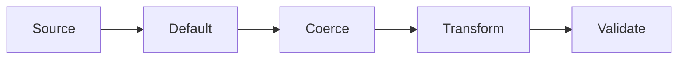

# Inputs - Transformations

Modify input values after coercion but before validation. Perfect for normalization, formatting, and data cleanup.

## Processing Pipeline

Each input flows through a fixed pipeline:



| Stage | Description |
|-------|-------------|
| **Source** | Resolve value from context, method, proc, or callable |
| **Default** | Apply `default:` when the resolved value is `nil` |
| **Coerce** | Convert via `coerce:` (e.g., string → integer) |
| **Transform** | Apply `transform:` to the coerced value |
| **Validate** | Run validators (presence, format, etc.) on the final value |

This means transformations receive already-coerced values, and validators see the final transformed output.

## Declarations

### Symbol References

Reference a method by symbol. The value's own method takes precedence (called as `value.send(symbol)` with no arguments); if the value doesn't respond to it, CMDx falls back to `task.send(symbol, value)`:

```ruby
class ProcessAnalytics < CMDx::Task
  input :options, transform: :compact_blank   # value.compact_blank or task#compact_blank(value)
end
```

### Proc or Lambda

Use anonymous functions for inline transformations:

```ruby
class CacheContent < CMDx::Task
  # Proc
  input :expire_hours, transform: proc { |v| v * 2 }

  # Lambda
  input :compression, transform: ->(v) { v.to_s.upcase.strip[0..2] }
end
```

### Class or Module

Use any object that responds to `#call(value, task)` for reusable transformation logic:

```ruby
class EmailNormalizer
  def call(value, task)
    value.to_s.downcase.strip
  end
end

class ProcessContacts < CMDx::Task
  # Class or Module
  input :email, transform: EmailNormalizer

  # Instance
  input :email, transform: EmailNormalizer.new
end
```

## Pipeline Position

Validations run on transformed values, ensuring data consistency:

```ruby
class ScheduleBackup < CMDx::Task
  # Coerce then clamp
  input :retention_days, coerce: :integer, transform: proc { |v| v.clamp(1, 5) }

  # Downcase then validate inclusion
  optional :frequency, transform: :downcase, inclusion: { in: %w[hourly daily weekly monthly] }
end
```
