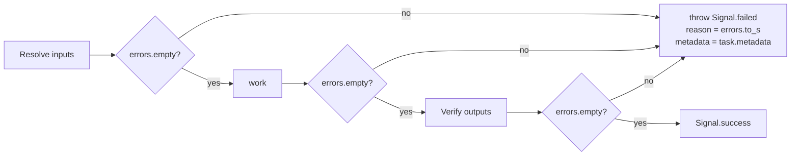

# Outcomes - Errors

`CMDx::Errors` is the per-task container for keyed, deduplicating failure messages — typically one key per attribute name. Validators, coercions, output verification, and hand-rolled `errors.add(...)` calls inside `work` all write here; a non-empty container at any lifecycle checkpoint causes `Runtime` to throw a failed signal.

!!! note

    `task.errors` and `result.errors` are the same object. Runtime teardown freezes `Errors` alongside `Task` and `Context`, so post-execution the container, its hash, and each underlying message `Set` are frozen.

## Access

Inside `work`, errors are reachable via the `errors` reader (or `task.errors` from outside). After execution, the same container is exposed on the frozen result:

```ruby
class CreateUser < CMDx::Task
  required :email, :password

  def work
    errors.add(:email, "already taken") if User.exists?(email: email)
    errors.add(:email, "must be verified") unless email_verified?(email)
  end
end

result = CreateUser.execute(email: "taken@example.com", password: "secret")

result.failed?        #=> true
result.errors.to_h    #=> { email: ["already taken", "must be verified"] }
result.errors.frozen? #=> true
```

## API

| Method | Purpose |
| ------ | ------- |
| `add(key, message)` | Append a message under a key; duplicates for the same key are silently dropped (backed by a `Set`). |
| `errors[key] = message` | Alias for `add`. |
| `merge!(other)` | Union every `(key, message)` pair from another `Errors` (or any object responding to `#to_hash`) into self. |
| `delete(key)` | Remove the key entirely; returns the removed `Set` or `nil`. |
| `clear` | Empty the container. Raises `FrozenError` post-teardown. |

| Method | Returns |
| ------ | ------- |
| `errors[key]` | `Array<String>` of messages under `key`, or a frozen empty array when absent. |
| `errors.added?(key, message)` | `true` when the exact message was recorded under `key`. |
| `errors.key?(key)` / `for?(key)` | `true` when `key` has at least one message. |
| `errors.keys` | Keys that have at least one message, in insertion order. |
| `errors.empty?` | `true` when no messages have been added. |
| `errors.size` | Number of distinct keys. |
| `errors.count` | Total messages across all keys. |
| `errors.each` | Yields `[Symbol, Set<String>]` pairs. `each_key` and `each_value` are also available. |

```ruby
def work
  errors.add(:amount, "must be positive") if amount.negative?
  errors[:amount] = "cannot exceed daily limit" if amount > 10_000

  # Fold in errors from a child task's result without overwriting local ones
  sub = ValidateAddress.execute(address: context.address)
  errors.merge!(sub.errors) if sub.failed?
end
```

Because `Errors` includes `Enumerable`, every standard enumerable method works (`any?`, `select`, `find`, `group_by`, `partition`, ...):

```ruby
result.errors.any? { |_key, set| set.size > 1 } # keys with multiple messages
result.errors.select { |key, _set| key.to_s.start_with?("address_") }
```

## Rendering

```ruby
class ConfigureServer < CMDx::Task
  required :hostname, :port, coerce: :integer
end

result = ConfigureServer.execute(port: "abc")

result.errors.to_h
#=> { hostname: ["is required"], port: ["could not coerce into an integer"] }

result.errors.full_messages
#=> { hostname: ["hostname is required"],
#     port:     ["port could not coerce into an integer"] }

result.errors.to_s
#=> "hostname is required. port could not coerce into an integer"

result.reason == result.errors.to_s #=> true
```

`to_hash` mirrors `to_h` by default and `full_messages` when called with `true`.

## Failure Propagation

Runtime checks `task.errors.empty?` at three lifecycle checkpoints: after input resolution, after `work` returns, and after output verification. A non-empty container at any checkpoint short-circuits the rest of the lifecycle by throwing a failed signal whose `reason` is `errors.to_s` and whose `metadata` is `task.metadata`.



This is `Runtime#signal_errors!`, called at each stage.

!!! warning "Important"

    Adding errors inside `work` does **not** halt execution immediately — the throw happens after `work` returns (and again after output verification). To halt mid-`work`, use `fail!(...)` instead.

## Freeze Semantics

```ruby
result = CreateUser.execute(email: "")

result.errors.frozen?                  #=> true
result.errors.messages.frozen?         #=> true
result.errors.messages[:email].frozen? #=> true   (the underlying Set)
result.errors[:email].frozen?          #=> false  (#[] returns a fresh Array via Set#to_a)
result.errors.add(:x, "y")             #=> raises FrozenError
```

`Errors#freeze` deep-freezes every message `Set` before freezing the container itself.

## See Also

- [Inputs - Validations](../inputs/validations.md) — validators that populate `errors` automatically.
- [Inputs - Coercions](../inputs/coercions.md) — coercion failures land here.
- [Outputs](../outputs.md) — output verification errors fold into the same container.
- [v1 → v2 Migration](../v2-migration.md#errors) — what changed about `Errors` in 2.0.
