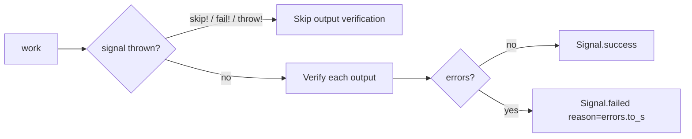

# Outputs

Outputs declare keys the task is expected to write to `context`. Every declared output is implicitly required: after `work` succeeds, the runtime checks each declared key on `task.context`, applies a default when the value is absent or `nil`, and fails the task if the key is still missing. Outputs are intentionally minimal — for coercion, transformation, validation, or nested resolution use [Inputs](inputs/definitions.md) (or post-`work` code).

## Declaration

Use `output` (singular) or `outputs` (they're aliases) to declare one or more keys:

```ruby
class AuthenticateUser < CMDx::Task
  required :email, :password

  output :source
  output :user, :token

  def work
    context.source = email.include?("@mycompany.com") ? :admin_portal : :user_portal
    context.user   = User.authenticate(email, password)
    context.token  = JwtService.encode(user_id: context.user.id)
  end
end
```

### Options

| Option        | Default | Description                                                                |
|---------------|---------|----------------------------------------------------------------------------|
| `default:`    | —       | Fallback value, Symbol, Proc, or `#call(task)`-able; applied when `context[name]` is `nil` or the key is absent |
| `if:` / `unless:` | —   | Skip verification entirely when the predicate isn't satisfied              |
| `description:` (alias `desc:`) | — | Documentation surfaced via `outputs_schema`                |

```ruby
output :report_path
output :exported_at, if: -> { context.persist? }    # Proc/Lambda is instance_exec'd (no args)
output :tracked, if: :persist?                       # Symbol calls task.persist?
```

### Defaults

Defaults let you declare constants or derived values alongside the output instead of computing them inside `work`. A default fires during verification whenever the resolved value is `nil` — both "key absent" and "task wrote nil" — and satisfies the implicit required check.

```ruby
class ComputeRecommendations < CMDx::Task
  output :version, default: "v2"                          # literal
  output :source, default: :default_source                # Symbol → task#default_source
  output :generated_at, default: -> { Time.now }          # Proc → instance_exec on task
  output :tenant, default: TenantDefaults                 # anything responding to #call(task)

  def work
    # Defaults are applied during verification (after work). Assign in work
    # to override a default; leave absent or nil to let the default fill in.
  end

  private

  def default_source = self.class.name
end
```

See [Inputs - Defaults](inputs/defaults.md) for the long-form treatment of each shape — the resolution rules are identical.

## Removals

Outputs inherit through subclasses. Remove inherited declarations with `deregister` — pass one or more keys per call:

```ruby
class ApplicationTask < CMDx::Task
  output :audit_log
  output :request_id
end

class LightweightTask < ApplicationTask
  deregister :output, :audit_log, :request_id

  def work
    # No longer required to set context.audit_log or context.request_id
  end
end
```

## Verification Behavior

Verification runs **after** `work` completes successfully. If `work` threw a `skip!`, `fail!`, or `throw!` signal, outputs are not verified.



For each output, in declaration order: if `:if`/`:unless` excludes it, skip entirely; otherwise read `context[name]`, fall back to `:default` when `nil`, fail with `cmdx.outputs.missing` when the key was never written and no default produced a value, otherwise write the resolved value back to `context[name]`.

Verification errors fold into the same failed signal that input/validation failures use — `result.reason` is `task.errors.to_s` and `result.errors` exposes the structured map. Under `execute!`, the same failure raises `CMDx::Fault`.

### Missing Output

```ruby
class CreateUser < CMDx::Task
  output :user

  def work
    # Forgot to set context.user
  end
end

result = CreateUser.execute
result.failed?         #=> true
result.reason          #=> "user must be set in the context"
result.errors.to_h     #=> { user: ["must be set in the context"] }
```

### With Bang Execution

A failing output verification raises `CMDx::Fault`:

```ruby
begin
  CreateUser.execute!
rescue CMDx::Fault => e
  e.message                #=> "user must be set in the context"
  e.result.errors[:user]   #=> ["must be set in the context"]
  e.task                   #=> CreateUser (the failing task class)
end
```

## Schema Introspection

`Task.outputs_schema` returns a serialized definition of every declared output, useful for documentation generation or runtime introspection:

```ruby
class CreateUser < CMDx::Task
  output :user, description: "the persisted user"
end

CreateUser.outputs_schema
# => { user: { name: :user,
#              description: "the persisted user",
#              options: { description: "the persisted user" } } }
```
