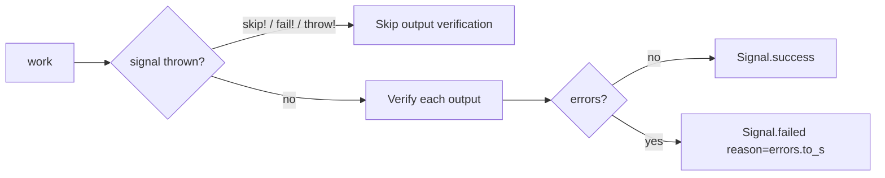

# Outputs

Outputs declare keys the task is expected to write to `context`. After `work` succeeds, the runtime verifies each declared output: it can enforce presence, coerce the value, and run validators against it. Coerced values are written back to context.

## Declaration

Use `output` (singular) or `outputs` (they're aliases) to declare one or more keys:

```ruby
class AuthenticateUser < CMDx::Task
  required :email, :password

  output :source
  output :user, :token, required: true

  def work
    context.source = email.include?("@mycompany.com") ? :admin_portal : :user_portal
    context.user   = User.authenticate(email, password)
    context.token  = JwtService.encode(user_id: context.user.id)
  end
end
```

### Options

| Option        | Default | Description                                                                |
|---------------|---------|----------------------------------------------------------------------------|
| `required:`   | `false` | When `true`, fails the task if the key is missing from context after `work`|
| `default:`    | —       | Fallback value, Symbol, Proc, or `#call(task)`-able; applied when `context[name]` is `nil` or the key is absent |
| `coerce:`     | —       | Same as inputs — single coercer or array applied to the written value      |
| `transform:`  | —       | Symbol, Proc, or `#call(value, task)`-able; applied after coercion and before validation |
| `validate:`   | —       | Inline callable validator (Symbol, Proc, lambda, or `#call`-able)          |
| `if:` / `unless:` | —   | Skip verification (and required-ness) when the predicate isn't satisfied   |
| `description:` (alias `desc:`) | — | Documentation surfaced via `outputs_schema`                |

Validator keys (`presence:`, `absence:`, `numeric:`, `format:`, `inclusion:`, `exclusion:`, `length:`) and any custom validators registered via `register :validator, ...` work the same as on inputs — see [Inputs - Validations](inputs/validations.md) for the full list.

```ruby
output :total, coerce: :big_decimal, numeric: { min: 0.01 }
output :report_path, required: true, presence: true
output :exported_at, required: true, if: ->(t) { t.context.persist? }
```

### Defaults

Defaults let you declare constants or derived values alongside the output instead of computing them inside `work`. A default fires during verification whenever the resolved value is `nil` — both "key absent" and "task wrote nil" — flows through coercion and transform, and can satisfy `:required`.

```ruby
class ComputeRecommendations < CMDx::Task
  output :version, default: "v2"                          # literal
  output :source, default: :default_source                # Symbol → task#default_source
  output :generated_at, default: -> { Time.now }          # Proc → instance_exec on task
  output :retention_days, default: "7", coerce: :integer  # defaults flow through coerce
  output :tenant, default: TenantDefaults                 # anything responding to #call(task)

  def work
    # Defaults are applied during verification (after work). Assign in work
    # to override a default; leave absent or nil to let the default fill in.
  end

  private

  def default_source = self.class.name
end
```

See [Inputs - Defaults](inputs/defaults.md) for the long-form treatment of each shape — the resolution rules are identical.

### Transformations

Transformations normalize whatever `work` wrote before validators run. Same pipeline as inputs:


```ruby
class CreateUser < CMDx::Task
  output :email, coerce: :string, transform: :downcase
  output :tags,  coerce: :array,  transform: proc { |v| v.uniq.sort }
  output :days,  coerce: :integer, transform: DayClamper,
                 numeric: { min: 1, max: 30 }

  def work
    context.email = params[:email]
    context.tags  = params[:tags]
    context.days  = params[:days]
  end
end
```

Symbol transforms try `value.send(sym)` first, then fall back to `task.send(sym, value)`. Proc transforms run via `instance_exec(value)` — lambdas must accept exactly one argument. Anything else must respond to `#call(value, task)` (use this path when you need access to the task). See [Inputs - Transformations](inputs/transformations.md) for the same semantics applied to inputs.

## Removals

Outputs inherit through subclasses. Remove inherited declarations with `deregister` — pass one or more keys per call:

```ruby
class ApplicationTask < CMDx::Task
  output :audit_log, required: true
  output :request_id, required: true
end

class LightweightTask < ApplicationTask
  deregister :output, :audit_log, :request_id

  def work
    # No longer required to set context.audit_log or context.request_id
  end
end
```

## Verification Behavior

Verification runs **after** `work` completes successfully. If `work` threw a `skip!`, `fail!`, or `throw!` signal, outputs are not verified.



For each output, in declaration order: if `:if`/`:unless` excludes it, skip entirely; otherwise follow the diagram. When the resolved value is `nil`, `:default` fires before the required check. A coercion failure adds an error and short-circuits `:transform` and validation; otherwise the pipeline runs `:transform`, then validators, then writes the final value back to `context[name]`.

Verification errors fold into the same failed signal that input/validation failures use — `result.reason` is `task.errors.to_s` and `result.errors` exposes the structured map. Under `execute!`, the same failure raises `CMDx::Fault`.

### Missing Output

```ruby
class CreateUser < CMDx::Task
  output :user, required: true

  def work
    # Forgot to set context.user
  end
end

result = CreateUser.execute
result.failed?         #=> true
result.reason          #=> "user must be set in the context"
result.errors.to_h     #=> { user: ["must be set in the context"] }
```

### With Bang Execution

A failing output verification raises `CMDx::Fault`:

```ruby
begin
  CreateUser.execute!
rescue CMDx::Fault => e
  e.message                #=> "user must be set in the context"
  e.result.errors[:user]   #=> ["must be set in the context"]
  e.task                   #=> CreateUser (the failing task class)
end
```

## Schema Introspection

`Task.outputs_schema` returns a serialized definition of every declared output, useful for documentation generation or runtime introspection:

```ruby
class CreateUser < CMDx::Task
  output :user, required: true, description: "the persisted user"
end

CreateUser.outputs_schema
# => { user: { name: :user,
#              description: "the persisted user",
#              required: true,
#              options: { required: true, description: "the persisted user" } } }
```
